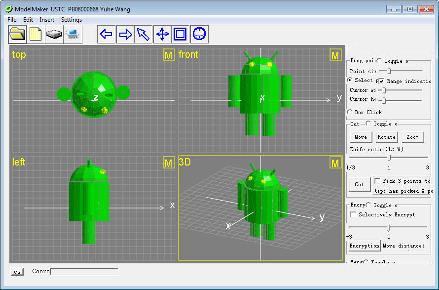

# ModelMaker
This program contains about 8000 lines and cost me the whole summer to finish it. It's designed to construct 3D models of arbitrary shapes, just as what 3DS MAX does, and generate files in specific format that can be read and analyzed by other simulation programs in our lab. Its idea is to construct basic geometries first and then modify them to the shapes you want. It provides various ways, like points manipulation, parameter control, cut and glue, etc. to achieve geometry transformation. It's very cool!

# Thesis
- [The Method of 3D Model Making for the Simulation of SEM Imaging and its Application in the Measurement of Si Lines](Report.pdf)